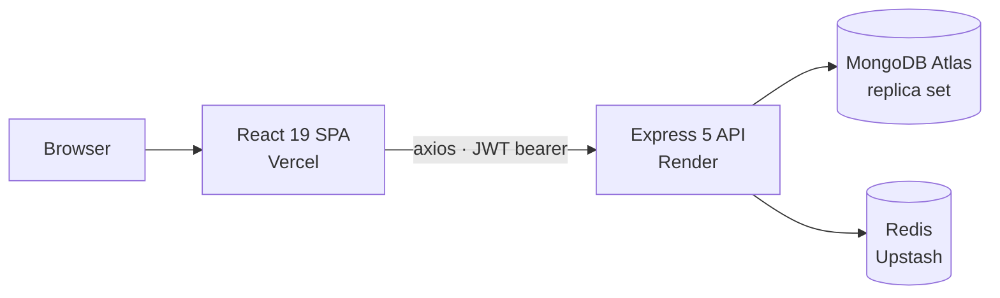
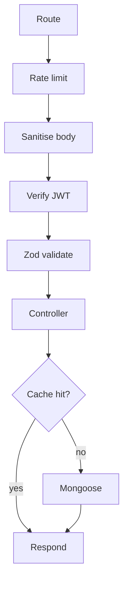
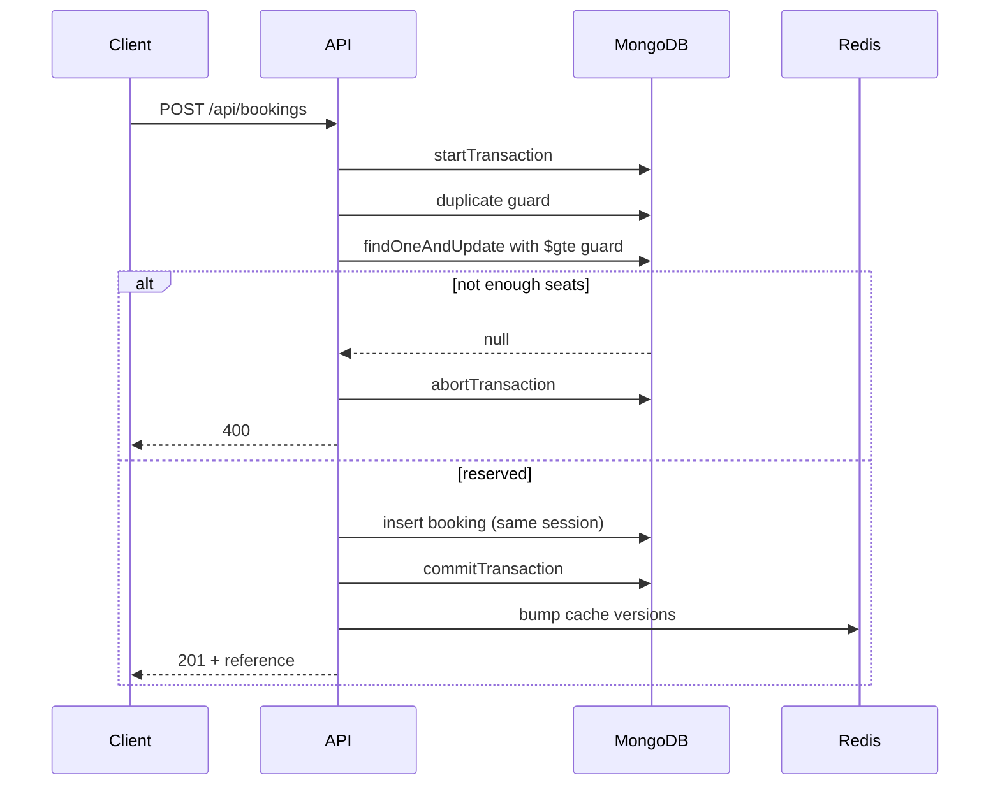
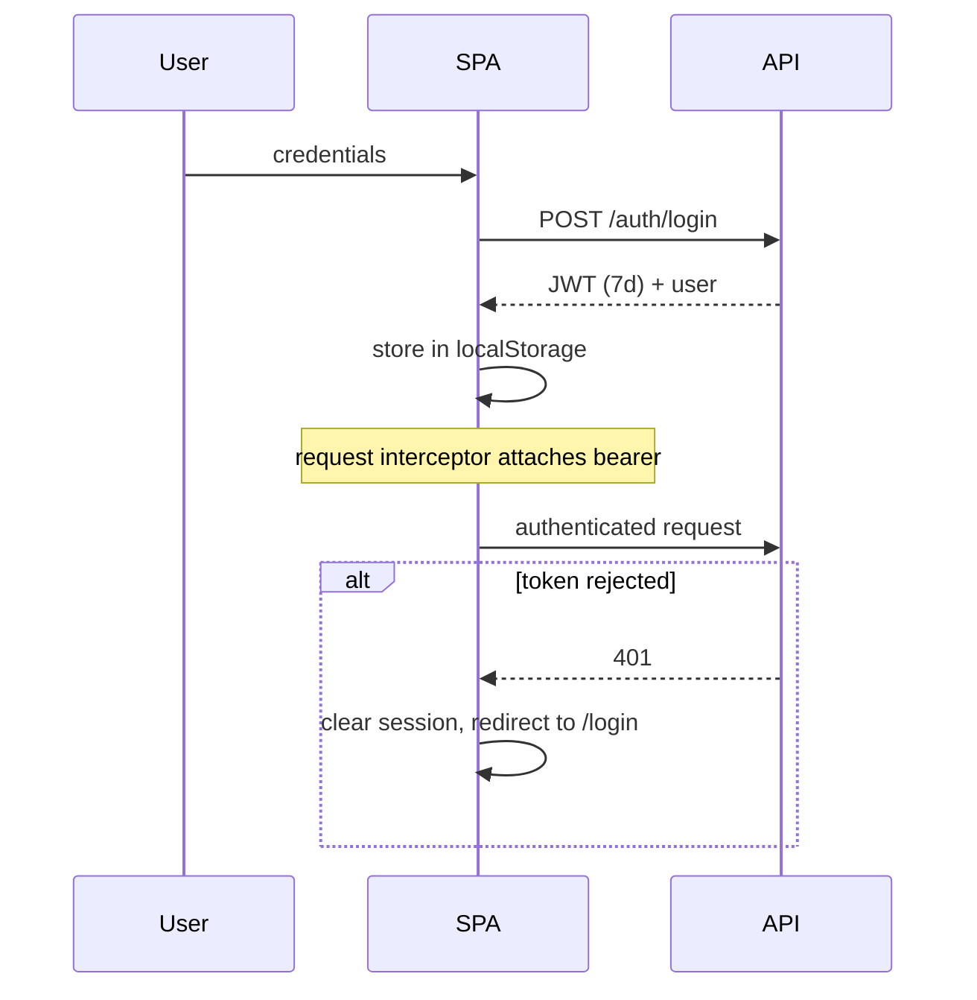

<div align="center">


# BookMyEvent

### Event ticketing that cannot oversell a seat.

A full-stack booking platform built around one hard guarantee: when two people click **Book** on the last seat at the same instant, exactly one succeeds.

<br/>

[](https://github.com/Mukund934/BookMyEvent/actions/workflows/ci.yml)


**[Live App](https://book-my-event-lovat.vercel.app/)** · **[API](https://bookmyevent-backend-2u7p.onrender.com)** · **[Swagger Docs](https://bookmyevent-backend-2u7p.onrender.com/api-docs)**

</div>

---

## Why this project exists

Most CRUD portfolio projects avoid the one thing that makes their domain difficult. For ticketing, that thing is **finite inventory under concurrent access**.

The naive implementation reads the seat count, checks it, then writes — and is wrong the moment two requests interleave. BookMyEvent instead issues a **conditional atomic update inside a MongoDB transaction**: the database itself refuses to let availability go negative, and the seat decrement and booking insert either both commit or neither does.

Everything else in the product — search, categories, analytics, QR tickets, password reset — is built around that core and exists to make it a real application rather than a demo of one function.

**Who it's for:** attendees who want to find and reserve seats, and organizers who want to publish events and see how they're selling.

> **Try it:** open the [live app](https://book-my-event-lovat.vercel.app/) and use **Fill demo credentials** on the sign-in page.
> The API sleeps on Render's free tier, so the first request after an idle period can take up to a minute. Screens that fail offer a retry rather than pretending there's no data.

---

## Screenshots

<!-- Replace each placeholder below with a current screenshot. -->

| | |
|---|---|
| <!-- Landing page --> **Landing** <br/> _Hero, value proposition and entry points into event discovery._ | <!-- Events listing --> **Event Discovery** <br/> _Filter toolbar with search, category and sort; responsive card grid._ |
| <!-- Event details --> **Event Details** <br/> _Live seat availability, bounded ticket stepper, organizer identity._ | <!-- Organizer dashboard --> **Dashboard** <br/> _Revenue, bookings, cancellation rate and charted booking trend._ |
| <!-- QR ticket page --> **QR Ticket** <br/> _Printable ticket with QR code and booking reference._ | <!-- Auth pages --> **Authentication** <br/> _Sign in, registration and the password reset flow._ |
| <!-- Mobile view --> **Mobile** <br/> _Navigation drawer and stacked layouts at 375px._ | <!-- Footer/legal pages --> **Resource Pages** <br/> _Documentation, Help Center, Support and legal pages._ |

## Demo

<!-- Replace with a 45–60s screen recording: browse → search → book → ticket → dashboard → edit -->

| | |
|---|---|
| **Live demo** | [book-my-event-lovat.vercel.app](https://book-my-event-lovat.vercel.app/) |
| **Video walkthrough** | _<!-- Add link -->_ |
| **Animated preview** | _<!-- Add GIF -->_ |

---

## Features

<table>
<tr><td width="50%" valign="top">

**Authentication**
- Registration with an 8-character password minimum
- JWT sign-in (HS256, 7-day expiry)
- Password reset with hashed, expiring tokens
- Route guard that validates token expiry, not just presence
- Global 401 interceptor that clears the session and redirects

**Event Discovery**
- Debounced search across title and location
- Filter by category, sort by date or price
- Server-side pagination with real totals
- Category badges and cover images with placeholder fallback

**Booking**
- Atomic, transaction-safe seat reservation
- Stepper bounded by real availability; sold-out state surfaced
- Human-readable reference (`BME-ADJ68ECK`)
- Printable QR ticket
- Cancellation with inline confirmation and immediate seat restoration

</td><td width="50%" valign="top">

**Organizer**
- Publish events with category, image, price and capacity
- Edit any field; capacity cannot drop below seats sold
- Delete, blocked while active bookings exist
- Organizer-only controls, enforced server-side

**Dashboard & Analytics**
- Revenue, bookings, cancellations, cancellation rate
- Charted monthly booking trend
- Top events ranked by revenue
- Scoped to the caller's events only

**Engineering**
- 10 tests against a real MongoDB replica set
- GitHub Actions CI on every push
- Redis caching with versioned keys
- Route-level code splitting
- Error boundary, skeleton and error states throughout

</td></tr>
</table>

---

## Technical highlights

<details open>
<summary><b>Concurrency-safe seat inventory</b></summary>

<br/>

The decrement carries its own guard, so the database rejects an oversell rather than the application checking first and hoping:

```ts
const event = await Event.findOneAndUpdate(
  { _id: eventId, availableSeats: { $gte: seats } },
  { $inc: { availableSeats: -seats } },
  { new: true, session },
);

if (!event) throw new ApiError(400, "Not enough seats available");
```

If the filter doesn't match, no document is returned and nothing was written. Combined with a transaction wrapping the booking insert, the two operations commit together or not at all.

</details>

<details>
<summary><b>Mutation-verified tests</b></summary>

<br/>

The suite was checked by deliberately breaking the code:

| Mutation | Suite result |
|---|---|
| Remove `$gte` guard from the atomic decrement | **fails** ✓ |
| Remove application-level duplicate check only | passes — the partial unique index catches it |
| Remove **both** guards | **fails** ✓ |

The middle row initially looked like a weak test. Investigating found a bug in the mutation script itself; targeting the index precisely proved the suite is sound *and* that the partial unique index is doing genuine work.

</details>

<details>
<summary><b>Versioned cache invalidation</b></summary>

<br/>

Invalidation originally used `redis.keys()` — O(N) over the entire keyspace, blocking the server, running twice per booking. Cache keys now embed a version counter, so invalidation is a single `INCR`:

```ts
const version  = await getCacheVersion("events");
const cacheKey = `events:${version}:${page}:${limit}:${category}:${sort}`;

await bumpCacheVersion("events");   // O(1), touches no unrelated keys
```

This also fixed four dashboard keys that were never invalidated at all.

</details>

<details>
<summary><b>Graceful cache degradation</b></summary>

<br/>

Every cached read previously opened with a bare `await redis.get(...)`, so an unreachable Redis returned a 500 — even on the public events listing, which has a working database fallback three lines below. The client wrapper now resolves failures to a cache miss instead of rejecting, verified against a genuinely dead server.

</details>

<details>
<summary><b>Other</b></summary>

<br/>

Route-level code splitting (34 chunks, 88 kB gzipped entry) · error boundary around the router · typed Mongoose documents · Zod validation · shared UI primitives · labelled form controls · environment-driven API URL · idempotent boot-time migrations.

</details>

---

## Architecture



**Request path** — routes stay thin, middleware handles cross-cutting concerns, controllers hold business logic:



**Booking transaction** — the part that matters:



> **Note** — cache invalidation and the HTTP response happen **after** commit and outside the transaction's `try`. An earlier version had them inside it, so a Redis blip called `abortTransaction()` on an already-committed session, masking the real error and reporting a successful booking as failed.

**Authentication**



**There is deliberately no backend service layer.** Business logic lives in controllers. At ~2,440 backend lines the extra indirection would cost more in navigation than it returns in structure — a decision worth revisiting if the domain grows.

---

## Project structure

```
BookMyEvent/
├── .github/workflows/ci.yml     # typecheck · lint · build · test
├── backend/                     # Express API — 2,440 LOC across 36 files
│   └── src/
│       ├── __tests__/           # replica-set integration tests (369 LOC)
│       ├── config/              # redis client, migrations, swagger, env
│       ├── controllers/         # auth · event · booking · dashboard · health
│       ├── middleware/          # auth · validate · error · security · rate limit
│       ├── models/              # User · Event · Booking (typed, 7 indexes)
│       ├── routes/api/          # 19 endpoints with Swagger JSDoc
│       └── utils/               # ApiError · asyncHandler · cacheVersion · mailer
├── frontend/                    # React SPA — 5,686 LOC across 50 files
│   └── src/
│       ├── components/          # 17 shared components
│       ├── pages/               # 19 route components
│       ├── services/            # axios instance + one module per domain
│       ├── types/               # API response contracts
│       └── utils/               # formatting · error normalisation
└── docs/                        # README assets
```

---

## Tech stack

| Layer | Choice |
|---|---|
| **Frontend** | React 19 · TypeScript · Vite 8 · Tailwind CSS v4 · react-router-dom 7 |
| **Backend** | Node · Express 5 · TypeScript (`strict`) |
| **Database** | MongoDB Atlas · Mongoose 9 (typed documents, transactions) |
| **Cache** | Redis · ioredis (versioned keys, degrades to miss) |
| **Auth** | JWT HS256 · bcrypt |
| **Validation** | Zod 4 |
| **Testing** | Vitest · mongodb-memory-server (real replica set) |
| **CI/CD** | GitHub Actions · Vercel · Render |
| **Docs** | Swagger UI at `/api-docs` |

---

## Installation

**Requirements:** Node 18+, a MongoDB **replica set** (Atlas works — transactions require one), optionally Redis.

```bash
git clone https://github.com/Mukund934/BookMyEvent.git
cd BookMyEvent

# API
cd backend && npm install && cp .env.example .env
npm run dev                     # http://localhost:5000

# Web (new terminal)
cd frontend && npm install && cp .env.example .env
npm run dev                     # http://localhost:5173
```

### Environment variables

**`backend/.env`**

| Variable | Required | Purpose |
|---|:---:|---|
| `MONGO_URI` | ✅ | Connection string. Must be a replica set — booking uses transactions. Asserted at boot. |
| `JWT_SECRET` | ✅ | Token signing key. The server exits if unset rather than failing at request time. |
| `PORT` | — | Defaults to `5000`. |
| `REDIS_URL` | — | Omit to run without caching; the app degrades to database reads. |
| `CLIENT_URL` | — | CORS origin and the base for password-reset links. |

**`frontend/.env`**

| Variable | Required | Purpose |
|---|:---:|---|
| `VITE_API_URL` | — | API base URL including `/api`. **Set this locally** — without it the client falls back to the deployed API and your dev session writes to production data. |

### Running locally

```bash
# development
cd backend  && npm run dev
cd frontend && npm run dev

# tests (first run downloads a mongod binary)
cd backend && npm test

# production build
cd backend  && npm run build && npm start
cd frontend && npm run build && npm run preview
```

---

## API overview

Base URL `/api` · 19 endpoints · interactive docs at **[/api-docs](https://bookmyevent-backend-2u7p.onrender.com/api-docs)**

| Group | Endpoints | Notes |
|---|---|---|
| `/auth` | register · login · forgot-password · reset-password | all rate limited; reset responds identically whether or not the account exists |
| `/events` | list · detail · create · update · delete · analytics | list supports search, category, sort, date, location, pagination |
| `/bookings` | create · my-bookings · cancel | create is transactional; ownership enforced on cancel |
| `/dashboard` | overview · top-events · trends · cancellations · heatmap | scoped to the caller's own events |
| `/health` | liveness | — |

---

## Testing

Ten tests exercise the **real controllers** against an **in-memory MongoDB replica set**, so transactions genuinely execute rather than being mocked away. Redis is stubbed, since caching isn't what's under test.

Tests assert **invariants, not implementation**:

| Invariant |
|---|
| Seats decrement by exactly the amount booked, and the amount owed is recorded |
| An oversell request is refused and leaves inventory untouched |
| 12 concurrent bookings for 5 seats never drive availability negative |
| A second active booking for the same event is rejected |
| Cancellation restores seats exactly once |
| A booking cannot be cancelled by another user |
| A booking cannot be cancelled twice |
| Capacity cannot be edited below seats already sold |
| Growing capacity recalculates availability from seats sold |
| An event cannot be edited by a non-owner |

The concurrency test fires twelve simultaneous bookings at a five-seat event and asserts that confirmed bookings never exceed five, persisted bookings match confirmations, and final availability equals `5 − confirmed`.

CI runs typecheck, lint, build and the full suite on **every push and pull request** to `main`.

---

## Engineering decisions

Choices made deliberately, with the trade-off stated rather than hidden.

| Decision | Reasoning |
|---|---|
| **No service layer** | At 2,440 backend lines, indirection costs more in navigation than it returns. Revisit if the domain grows. |
| **No RBAC enforcement** | Roles exist in the schema but nothing consumes them. The product model is open-host, like Eventbrite. Adding a guard with no consumer would be dead code. |
| **JWT in `localStorage`, no refresh token** | Simplification appropriate to a demo. The trade-off — XSS readability, 7-day non-revocable window — is documented in the app's own privacy policy rather than glossed over. |
| **Password reset without email delivery** | The flow is complete: token generation, hashing, expiry, validation, update. Only the transport is missing, because it needs a provider and credentials. Swapping one function in `utils/mailer.ts` completes it. |
| **Images by URL, not upload** | Object storage is infrastructure, not code. A URL field closes the visual gap with none. |
| **No payments** | Prices exist to make booking and analytics realistic. No card details are ever requested or stored. |

---

## Performance

| Optimisation | Result |
|---|---|
| Logo resized and converted to WebP | 849 kB → **6 kB** (rendered at 80×80) |
| README screenshots moved out of `public/` | ~1.7 MB removed from the deployed build |
| Route-level code splitting | 34 chunks; entry **88 kB gzipped** |
| Deployed assets overall | ~2.9 MB → **556 kB** |
| Cache invalidation | `KEYS` (O(N), blocking) → versioned keys (O(1)) |
| Database indexes | 7 across three models; dashboard aggregations were previously full collection scans |
| Dashboard queries | six sequential round trips → two concurrent batches |

---

## Security

Implemented: bcrypt password hashing · JWT with pinned HS256 · boot-time secret assertion · per-user authorisation on every mutating route · MongoDB operator stripping on request bodies · regex escaping with length caps · rate limiting keyed on the real client IP behind the proxy · Helmet headers · capped pagination · generic client-facing error messages · SHA-256 hashed reset tokens with 30-minute expiry · anti-enumeration responses on password reset · constant-work login path.

Known trade-offs are listed under [Engineering decisions](#engineering-decisions).

---

## Accessibility

Form controls are bound with `label[for]` / `id` pairs across sign-in, registration, event creation and editing. Error banners announce via `role="alert"`; the ticket QR carries a descriptive `alt`; chart bars expose their values through `aria-label` since bar length conveys nothing to a screen reader; decorative icons are hidden with `aria-hidden`; the navigation toggle exposes `aria-expanded`; skeletons respect `prefers-reduced-motion`.

Not yet done: a full keyboard-navigation audit and a measured contrast pass.

---

## Lessons learned

**Correct-looking code can be silently wrong.** The seat decrement was right from day one, but `abortTransaction()` sat in a `catch` that also covered post-commit cache work. A Redis failure would abort an already-committed transaction, mask the original error, and report a real booking as failed. Nothing about reading the function suggested it.

**Schema defaults are not stored values.** Mongoose applies `default` when *hydrating* a document, so every legacy event reported `category: "Other"` while the field was absent in the database. Filtering by "Other" returned nothing — the API confidently contradicted itself, and only an end-to-end check caught it.

**Library majors move constants.** Zod v4 renamed `ZodError.errors` to `.issues`. Validation still rejected bad input, but every message collapsed to a generic string: a failure with no error and no log line.

**Verify against the deployed thing.** Several fixes typechecked, linted and built while being wrong in the browser — a retry button that could never succeed, a filter that matched nothing, a search with no loading feedback.

**Write the test that can fail.** The suite only became trustworthy after deliberately breaking the code to confirm it noticed — a process that also exposed a bug in the mutation script itself.

---

## Future improvements

- [ ] Refresh screenshots and record a walkthrough
- [ ] Frontend component tests
- [ ] Email transport for password reset
- [ ] Payment integration
- [ ] Real-time seat updates over WebSockets
- [ ] Organizer profile pages

---

## What this project demonstrates

<table>
<tr><td width="33%" valign="top">

**Backend engineering**
- Transactional integrity
- Concurrency-safe inventory
- Cache invalidation strategy
- Index design
- REST API design
- Middleware composition

</td><td width="33%" valign="top">

**Frontend engineering**
- Modern React 19 patterns
- Code splitting and lazy loading
- Race-condition handling
- Error boundaries
- Shared component design
- Accessible forms

</td><td width="33%" valign="top">

**Engineering practice**
- Integration testing
- Mutation verification
- CI/CD
- Performance measurement
- Security hardening
- Honest documentation

</td></tr>
</table>

---

## Contributing

Issues and pull requests welcome. CI runs typecheck, lint, build and the test suite on every push and PR to `main`.

```bash
cd backend  && npm run build && npm test
cd frontend && npx tsc -b && npx eslint . && npm run build
```

## License

[MIT](./LICENSE)

## Contact

<div align="center">

**Mukund Thakur** — B.Tech ECE, IIIT Naya Raipur

[GitHub](https://github.com/Mukund934) · <!-- LinkedIn --> · <!-- Portfolio --> · <!-- Email -->

</div>
