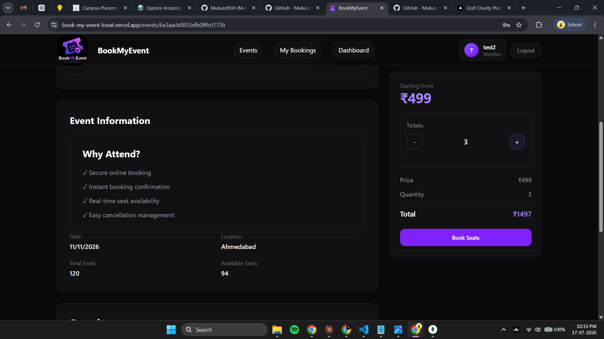
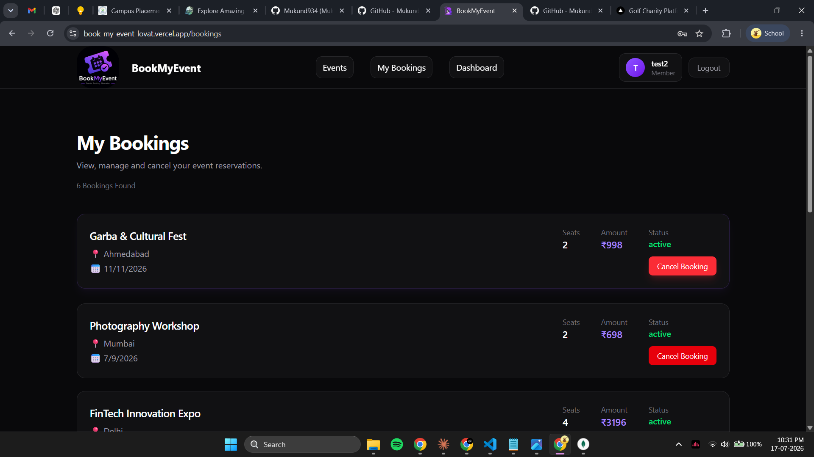

<div align="center">


A modern full-stack Event Booking Platform built with React, TypeScript, Node.js, Express, MongoDB, Redis, and JWT Authentication.

</div>
<div align="center">


A full-stack Event Booking System built with modern backend practices, secure authentication, analytics, caching, and transaction-safe booking workflows.

Designed as part of a Full Stack Developer Internship Assessment while focusing on maintainability, scalability, and real-world engineering practices.

</div>

---

## 📸 Preview

### 🏠 Landing Page

<p align="center">
  
</p>

---

### 🎫 Discover Events

<p align="center">
  
</p>

---

### 🎪 Event Details & Seat Availability

<p align="center">
  
</p>

---

### 🛒 Booking Workflow

<p align="center">
  
</p>

---

### 📊 Dashboard Analytics

<p align="center">
  
</p>

---

### 📋 My Bookings

<p align="center">
  
</p>

---

## ✨ Features

### Authentication

* User Registration
* Secure Login
* JWT Authentication
* Protected Routes
* Rate Limited Authentication Endpoints

### Event Management

* Create Events
* View All Events
* Event Details
* Event Analytics
* Pagination Support
* Filtering Support

### Booking Management

* Book Seats
* View Personal Bookings
* Cancel Bookings
* Automatic Seat Restoration
* Duplicate Booking Prevention

### Analytics Dashboard

* Total Revenue
* Total Bookings
* Cancellation Rate
* Top Performing Events
* Monthly Booking Trends

### Performance Optimizations

* Redis Caching
* Dashboard Cache Layer
* Booking Cache Layer
* Analytics Cache Layer
* Cache Invalidation Strategy

### Security

* Helmet Security Middleware
* Rate Limiting
* JWT Authorization
* Request Validation
* Centralized Error Handling

---

## 🏗️ Complete System Architecture

```text
┌─────────────────────────────────────┐
│             Frontend                │
│                                     │
│ React + TypeScript + Vite           │
│ Tailwind CSS                        │
│ React Router                        │
│ Axios                               │
└──────────────┬──────────────────────┘
               │
               ▼
┌─────────────────────────────────────┐
│          Service Layer              │
│                                     │
│ auth.service.ts                     │
│ event.service.ts                    │
│ booking.service.ts                  │
│ dashboard.service.ts                │
└──────────────┬──────────────────────┘
               │
               ▼
┌─────────────────────────────────────┐
│          Backend API                │
│                                     │
│ Node.js                             │
│ Express.js                          │
│ TypeScript                          │
│ JWT Authentication                  │
│ Zod Validation                      │
│ Error Middleware                    │
└──────────────┬──────────────────────┘
               │
      ┌────────┴────────┐
      ▼                 ▼
┌─────────────┐  ┌─────────────┐
│    Redis    │  │  MongoDB    │
│             │  │             │
│ Analytics   │  │ Users       │
│ Events      │  │ Events      │
│ Bookings    │  │ Bookings    │
│ Dashboard   │  │ Analytics   │
└─────────────┘  └─────────────┘
```

### Frontend Architecture

```text
src
│
├── pages
│   ├── landing
│   ├── auth
│   ├── events
│   ├── bookings
│   └── dashboard
│
├── components
│   ├── Layout
│   ├── Navbar
│   ├── ProtectedRoute
│   └── UI Components
│
├── services
│   ├── auth.service.ts
│   ├── event.service.ts
│   ├── booking.service.ts
│   └── dashboard.service.ts
│
├── types
│
└── assets
```

### Backend Architecture

```text
src
│
├── config
├── controllers
├── middleware
├── models
├── routes
├── services
├── validators
├── utils
├── types
└── server.ts
```

The application follows a modular full-stack architecture with clear separation between frontend UI, API services, business logic, caching, and database layers. This structure improves maintainability, scalability, and developer experience.


## ⚙️ Tech Stack

### Frontend

- React.js
- TypeScript
- Vite
- React Router DOM
- Axios
- Tailwind CSS
- Sonner (Toast Notifications)

### Backend

- Node.js
- Express.js
- TypeScript

### Database

- MongoDB
- Mongoose

### Caching

- Redis

### Authentication

- JWT (JSON Web Tokens)

### Validation

- Zod

### API Documentation

- Swagger UI

### Deployment

- Vercel (Frontend)
- Render (Backend)


## 🎯 Frontend Highlights

- Modern Responsive UI
- Protected Routes
- JWT Authentication Flow
- Event Discovery Experience
- Event Details Page
- Real-Time Seat Availability
- Booking Management
- Booking Cancellation
- Dashboard Analytics
- Event Creation Workflow
- Reusable Component Architecture
- API Service Layer Pattern
- Toast Notifications & User Feedback

---

## 🧪 Demo Test Account

You can use the following account to test the application:

### User Account

Email:
```text
test2@gmail.com
```

Password:
```text
12345678
```

Features available for testing:

- User Login
- Browse Events
- View Event Details
- Create Event
- Book Seats
- View My Bookings
- Cancel Booking
- Dashboard Analytics
- Logout

## 🌐 Live Demo


###  Frontend Application

 **[Launch BookMyEvent](https://book-my-event-lovat.vercel.app/)**

---

### ⚡ Backend API

 **[Backend Service](https://bookmyevent-backend-2u7p.onrender.com)**

---

### 📚 API Documentation

 **[Swagger Documentation](https://bookmyevent-backend-2u7p.onrender.com/api-docs)**


---

## 🔒 Booking Consistency

One important challenge in booking systems is preventing overselling when multiple users attempt to book seats simultaneously.

To address this:

* MongoDB Transactions are used
* Seat updates and booking creation happen together
* Failed operations automatically roll back
* Prevents inconsistent booking states

This ensures bookings remain reliable even under concurrent requests.

---

## 📊 Dashboard Overview Endpoint

```http
GET /api/dashboard/overview
```

Returns:

```json
{
  "totalRevenue": 125000,
  "totalBookings": 430,
  "cancelledBookings": 12,
  "cancellationRate": 2.79,
  "topEvents": [],
  "monthlyTrends": []
}
```

---

## 📚 API Documentation

Swagger documentation is available at:

```bash
/api-docs
```

The API documentation includes:

* Authentication APIs
* Event APIs
* Booking APIs
* Dashboard APIs
* Request/Response Schemas

---

## 🚀 Local Setup

### Clone Repository

```bash
git clone <repository-url>
cd backend
```

### Install Dependencies

```bash
npm install
```

### Configure Environment Variables

Create a `.env` file:

```env
PORT=5000

MONGO_URI=your_mongodb_connection_string

JWT_SECRET=your_jwt_secret

REDIS_URL=your_redis_connection_string
```

### Run Development Server

```bash
npm run dev
```

Server:

```bash
http://localhost:5000
```

Swagger:

```bash
http://localhost:5000/api-docs
```

---

## 📂 Project Structure

```text
src
├── config
├── controllers
├── middleware
├── models
├── routes
├── services
├── utils
├── types
└── server.ts
```

---

## 🧠 Design Decisions

### Why MongoDB?

The application deals with flexible event and booking data structures. MongoDB provides a simple and scalable document model that fits these requirements well.

### Why Redis?

Frequently accessed analytics and booking data are cached to reduce database load and improve response times.

### Why Transactions?

Booking creation and seat updates must remain consistent. Transactions ensure both operations either succeed together or fail together.

### Why Swagger?

Swagger provides interactive API documentation and makes testing endpoints easier during development and evaluation.

---

## 🔮 Future Improvements

* Payment Gateway Integration
* Email Notifications
* Role-Based Access Control
* Event Search Enhancements
* Event Image Uploads
* Admin Dashboard
* Real-Time Booking Updates
* Docker Deployment

---

## 👨‍💻 Author

**Mukund Thakur**

B.Tech, Electronics & Communication Engineering
IIIT Naya Raipur


---

Built with a focus on clean architecture, reliability, and real-world backend engineering practices.
