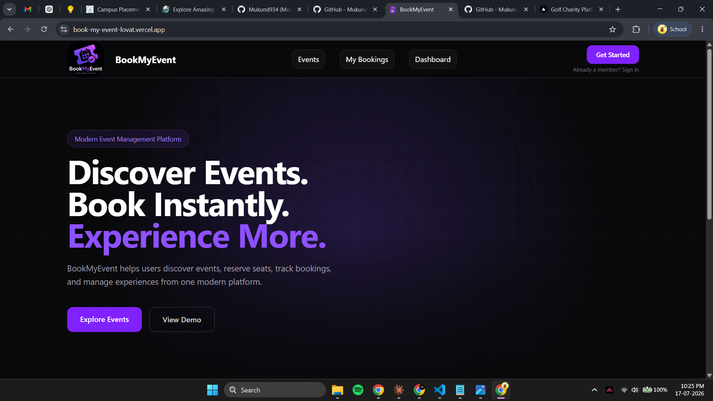
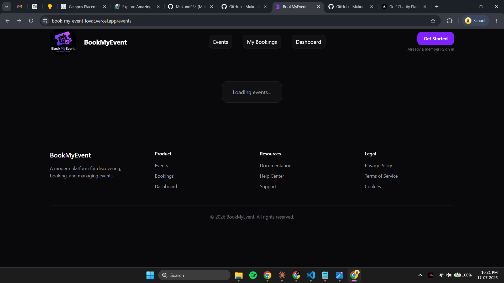
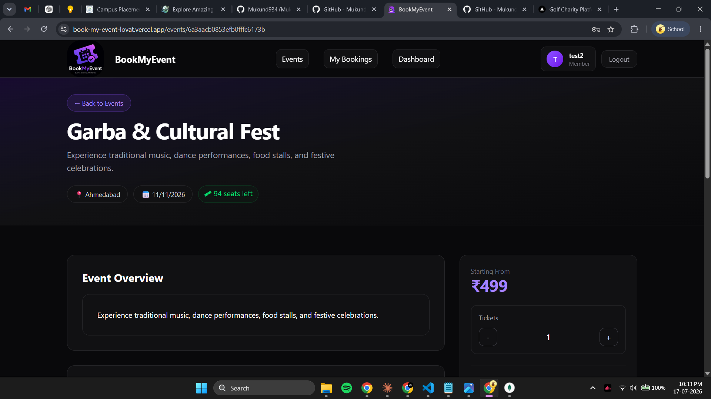
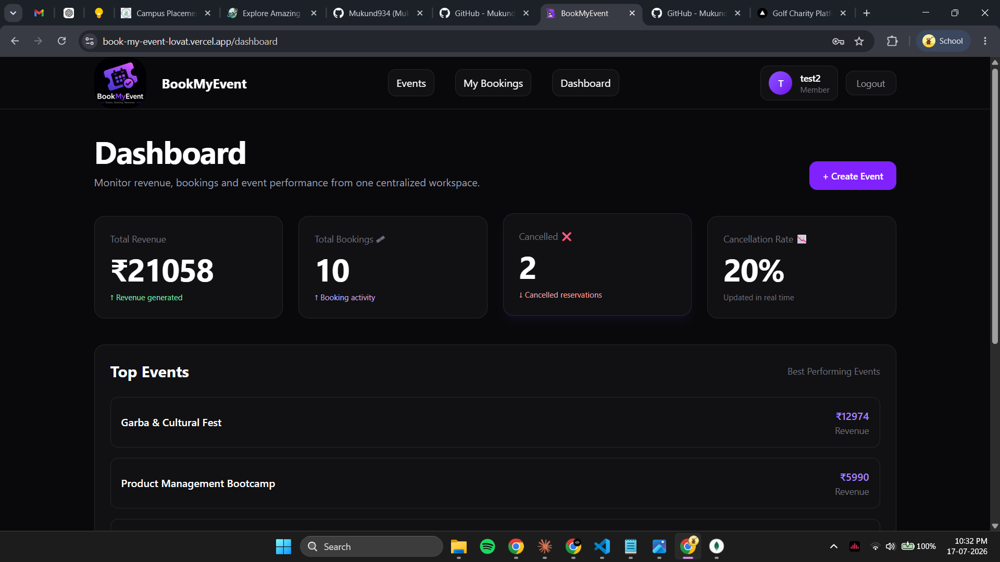
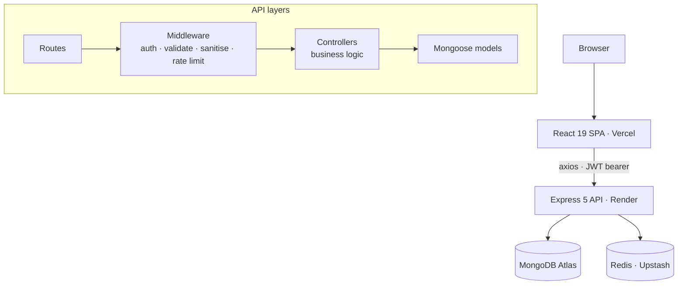
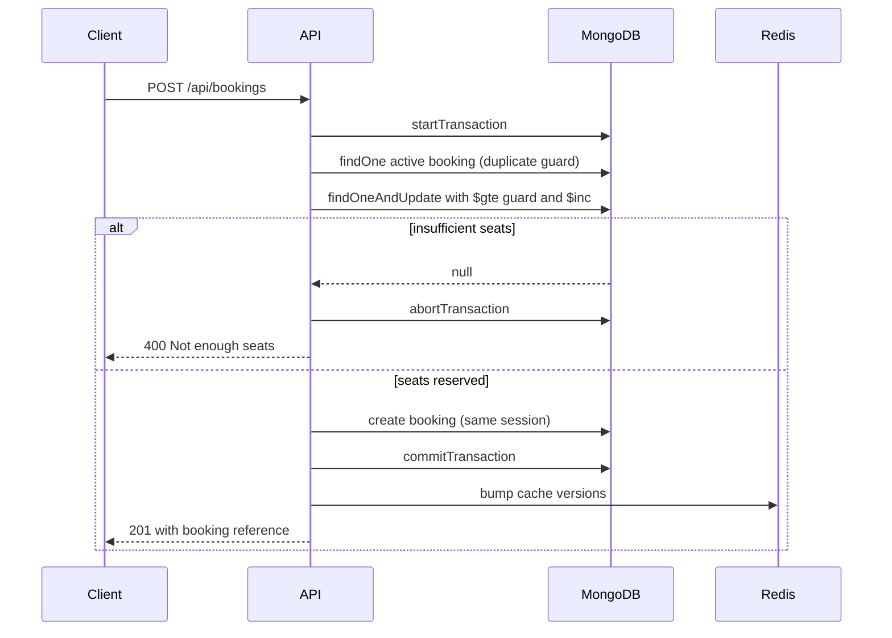

<div align="center">


# BookMyEvent

**An event ticketing platform where organizers publish events and attendees reserve seats — with inventory that stays correct under concurrent load.**

[Live App](https://book-my-event-lovat.vercel.app/) · [API](https://bookmyevent-backend-2u7p.onrender.com) · [API Docs](https://bookmyevent-backend-2u7p.onrender.com/api-docs)


[](https://github.com/Mukund934/BookMyEvent/actions/workflows/ci.yml)

</div>

---

## Overview

Seats are a finite resource. The hard part of a ticketing system is not the CRUD around it — it is guaranteeing that two people clicking "Book" on the last seat at the same instant cannot both succeed.

BookMyEvent solves that with a conditional atomic update inside a MongoDB transaction. The seat decrement and the booking insert either both commit or neither does, and the decrement itself carries a `$gte` guard, so the database refuses to go negative rather than the application checking first and hoping.

Everything else — search, categories, analytics, QR tickets — is built around that core.

**Try it:** sign in with `test2@gmail.com` / `12345678`, or register your own account. The demo database holds no real data and is reset periodically.

> The API runs on a free Render tier that sleeps when idle. The first request after a quiet period can take up to a minute; screens that fail offer a retry rather than pretending there is no data.

---

## Features

**For attendees**
- Browse, search, filter by category and sort events by date or price
- Live seat availability, with sold-out events surfaced before you commit
- Book seats through an atomic, transaction-safe reservation
- Printable ticket with a QR code and a readable reference (`BME-ADJ68ECK`)
- Cancel with inline confirmation; seats return to inventory immediately
- Password reset with hashed, expiring tokens

**For organizers**
- Publish events with category, cover image, pricing and capacity
- Edit any field; capacity cannot drop below seats already sold
- Delete events, blocked while active bookings exist
- Dashboard with revenue, bookings, cancellation rate, a monthly booking trend and top events by revenue

**Engineering**
- Redis caching with versioned keys — invalidation is a single `INCR`, never a keyspace scan
- Graceful degradation: a Redis outage becomes a cache miss, not a 500
- Route-level code splitting; the entry bundle is 87 kB gzipped
- Rate limiting, request sanitisation, security headers and per-user authorisation on every mutating route
- Booking invariants covered by tests running against a real MongoDB replica set, enforced in CI

---

## Screenshots

> These predate the most recent UI work (filter toolbar, dashboard charts, ticket page) and are due a refresh.

| Landing | Events |
|---|---|
|  |  |

| Event Details | Dashboard |
|---|---|
|  |  |

---

## Architecture



There is deliberately **no service layer**. Business logic lives in controllers. For an application this size the extra indirection would cost more in navigation than it returns in structure — a decision worth revisiting if the domain grows.

### Booking flow

The part that matters most:



Cache invalidation and the response happen **after** commit and outside the transaction's `try`. An earlier version had them inside it, so a Redis blip triggered `abortTransaction()` on an already-committed session — masking the real error and reporting a real booking as failed.

---

## Tech Stack

| Layer | Choice | Why |
|---|---|---|
| UI | React 19, TypeScript, Vite 8 | Fast builds, native code splitting |
| Styling | Tailwind CSS v4 | Utility-first, with shared primitives on top |
| Routing | react-router-dom 7 | Lazy-loaded routes |
| HTTP | axios | Interceptors for auth and 401 handling |
| API | Node, Express 5, TypeScript | `strict` mode throughout |
| Database | MongoDB + Mongoose 9 | Flexible documents; transactions for booking |
| Cache | Redis (ioredis) | Versioned keys, degrades to miss on failure |
| Auth | JWT (HS256) + bcrypt | 7-day access token |
| Validation | Zod 4 | Schema validation on mutating routes |
| Docs | Swagger UI | Served at `/api-docs` |

---

## Project Structure

```
BookMyEvent/
├── backend/                     # Express API — ~2,450 LOC
│   └── src/
│       ├── config/              # migrations, redis client, swagger, env
│       ├── controllers/         # auth, event, booking, dashboard, health
│       ├── middleware/          # auth, validate, error, security, rate limit
│       ├── models/              # User, Event, Booking (typed documents)
│       ├── routes/api/          # thin routers carrying Swagger JSDoc
│       ├── utils/               # ApiError, asyncHandler, cacheVersion, mailer…
│       └── server.ts            # boot, env assertions, migrations
│
├── frontend/                    # React SPA — ~5,780 LOC
│   └── src/
│       ├── components/          # Button, Card, Select, FormField, charts, states
│       ├── pages/               # auth, events, bookings, dashboard, legal, resources
│       ├── services/            # axios instance + one module per domain
│       ├── types/               # API response contracts
│       └── utils/               # formatting, error normalisation
│
└── docs/                        # screenshots and README assets
```

---

## API Overview

Base URL: `/api`

| Method | Endpoint | Auth | Notes |
|---|---|---|---|
| `POST` | `/auth/register` | — | rate limited |
| `POST` | `/auth/login` | — | rate limited |
| `POST` | `/auth/forgot-password` | — | identical response whether or not the account exists |
| `POST` | `/auth/reset-password` | — | hashed token, 30-minute expiry |
| `GET` | `/events` | — | `page`, `search`, `category`, `sort`, `location`, `date` |
| `GET` | `/events/:id` | — | organizer populated |
| `POST` | `/events/create` | ✔ | Zod validated |
| `PUT` | `/events/:id` | ✔ | organizer only |
| `DELETE` | `/events/:id` | ✔ | organizer only, blocked with active bookings |
| `GET` | `/events/:id/analytics` | ✔ | organizer only |
| `POST` | `/bookings` | ✔ | transactional |
| `GET` | `/bookings/my-bookings` | ✔ | paginated, capped at 50 |
| `DELETE` | `/bookings/:bookingId` | ✔ | ownership enforced |
| `GET` | `/dashboard/overview` | ✔ | scoped to the caller's events |
| `GET` | `/dashboard/top-events` | ✔ | granular analytics |
| `GET` | `/dashboard/trends` | ✔ | monthly booking trend |
| `GET` | `/dashboard/cancellations` | ✔ | cancellation breakdown |
| `GET` | `/dashboard/heatmap` | ✔ | bookings by location |
| `GET` | `/health` | — | liveness |

Interactive docs: **[/api-docs](https://bookmyevent-backend-2u7p.onrender.com/api-docs)**

---

## Setup

**Requirements:** Node 18+, a MongoDB replica set (Atlas works — transactions require one), and optionally Redis.

```bash
git clone https://github.com/Mukund934/BookMyEvent.git
cd BookMyEvent

# API
cd backend && npm install
cp .env.example .env      # fill in the values below
npm run dev               # http://localhost:5000

# Web
cd ../frontend && npm install
cp .env.example .env      # point VITE_API_URL at your API
npm run dev               # http://localhost:5173
```

> Without `VITE_API_URL` the frontend falls back to the **deployed** API, so set it locally unless you intend to work against production data.

### Environment Variables

**`backend/.env`**

| Variable | Required | Purpose |
|---|---|---|
| `MONGO_URI` | ✔ | Connection string; must be a replica set |
| `JWT_SECRET` | ✔ | Token signing key — asserted at boot |
| `PORT` | — | Defaults to `5000` |
| `REDIS_URL` | — | Omit to run without caching |
| `CLIENT_URL` | — | CORS origin and reset-link base |

**`frontend/.env`**

| Variable | Required | Purpose |
|---|---|---|
| `VITE_API_URL` | — | API base URL including `/api` |

---

## Deployment

Frontend on **Vercel** (`vercel.json` provides the SPA rewrite), API on **Render**, database on **MongoDB Atlas**, cache on **Upstash**. Both deploy from `main`.

Schema migrations run at boot from `config/migrations.ts` — idempotent backfills that no-op once applied.

---

## Lessons Learned

**Correct-looking code can be silently wrong.** The seat decrement was right from the start, but `abortTransaction()` sat in a `catch` that also covered post-commit cache work. A Redis failure would abort an already-committed transaction, mask the original error, and report a real booking as failed. Nothing about reading the function suggested it.

**Schema defaults are not stored values.** Mongoose applies `default` when *hydrating* a document, so every legacy event reported `category: "Other"` while the field was absent in the database. Filtering by "Other" returned nothing — the API confidently contradicted itself, and only an end-to-end check caught it.

**Library majors move constants.** Zod v4 renamed `ZodError.errors` to `.issues`. Validation still rejected bad input, but every message collapsed to a generic string: a failure with no error and no log line.

**Verify against the deployed thing.** Several fixes typechecked, linted and built while being wrong in the browser — a retry button that could never succeed, a filter that matched nothing, a search with no loading feedback.

---

## Roadmap

- [x] Automated tests around the booking concurrency path
- [x] CI running typecheck, lint, build and tests on every push
- [ ] Refresh screenshots to match the current UI
- [ ] Organizer profile pages
- [ ] Wishlist and recently viewed
- [ ] Payment integration
- [ ] Email delivery (the reset flow is complete except the transport)
- [ ] Real-time seat updates over WebSockets

---

## FAQ

**Are payments processed?** No. Prices exist to make booking and analytics realistic; no card details are ever requested or stored.

**Why is the first load slow?** The API sleeps on Render's free tier and cold-starts in 30–60 seconds.

**Why is there no service layer?** At ~2,450 backend lines the indirection would cost more than it returns. Documented as a deliberate trade-off rather than an oversight.

**Can anyone publish events?** Yes — the model is open-host, like Eventbrite. Roles exist in the schema but are not enforced, since nothing currently needs them.

**Does password reset send email?** The flow is complete — token generation, hashing, expiry, validation and update — but delivery logs the link instead of sending it. Swapping in a provider means replacing one function in `utils/mailer.ts`.

---

## Contributing

Issues and pull requests are welcome. CI runs typecheck, lint, build and the backend test suite on every push and pull request against `main`.

```bash
cd backend  && npm run build && npm test
cd frontend && npx tsc -b && npx eslint . && npm run build
```

The booking tests spin up an in-memory MongoDB replica set, so the first run downloads a `mongod` binary.

## License

[MIT](./LICENSE)

<div align="center">

Built by **[Mukund Thakur](https://github.com/Mukund934)** — B.Tech ECE, IIIT Naya Raipur

</div>
